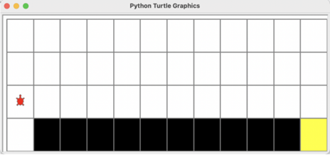
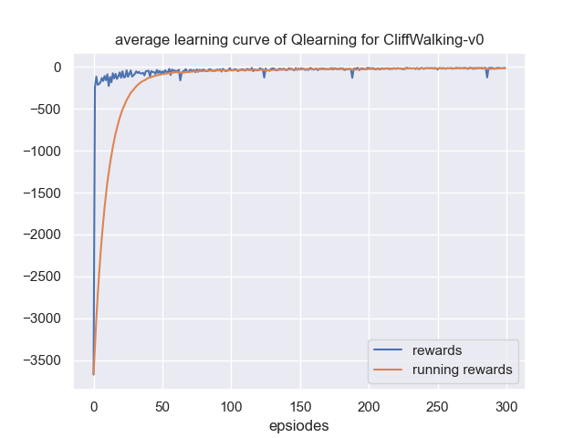

# QLearning(UESTC-人工智能)
## Solving Maze Path Finding Using Q-Table Method

Motion planning is a common application scenario in reinforcement learning. In this experiment, our task is to solve a simple maze pathfinding problem using the `Q-table` method from reinforcement learning. The algorithm is applied to the **CliffWalking-v0** environment from the open-source gym library.

## CliffWalking-v0 Environment

The environment is a 4*12 grid where the agent starts from the bottom-left corner and aims to reach the goal at the bottom-right corner. The objective is to move the agent to the goal position. The agent can move one step in four directions: up, down, left, and right. Each movement results in a -1 unit reward, meaning agents with fewer total steps will receive higher cumulative rewards. The simulation interface is shown below:




In the experiment:

- The agent cannot move outside the grid. If the next action would cause the agent to move beyond the boundary, the command won't execute, and a -1 reward is given
- If the agent falls into a cliff (black blocks in the simulation environment), it will immediately return to the starting point and receive a -100 reward
- The episode ends when the agent reaches the goal
- As shown in the diagram, the optimal path requires 13 steps, so the best possible reward score is around -13

## Task Requirements

This experiment provides the basic training interface and visualization for reinforcement learning. You only need to implement the Q-table reinforcement learning method. The training objective is to achieve an average reward of -13 during the evaluation phase.


## Algorithm Components to Complete

```
./agent.py 
choose_action()
predict()
update()
```

self.train_eps = 200

## Required Packages

```bash
gym==0.19.0
turtle
numpy
pathlib
```

Feel free to explore the code and documentation in the respective directories. DONT CHEAT IN YOUR HOMEWORK.